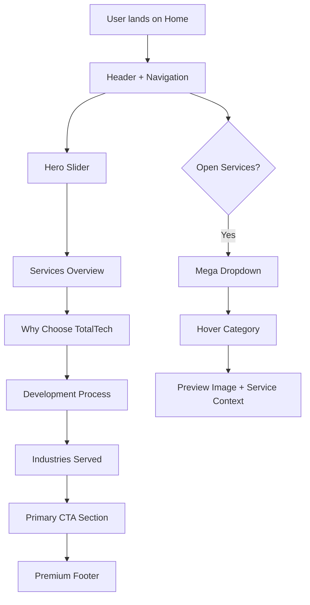
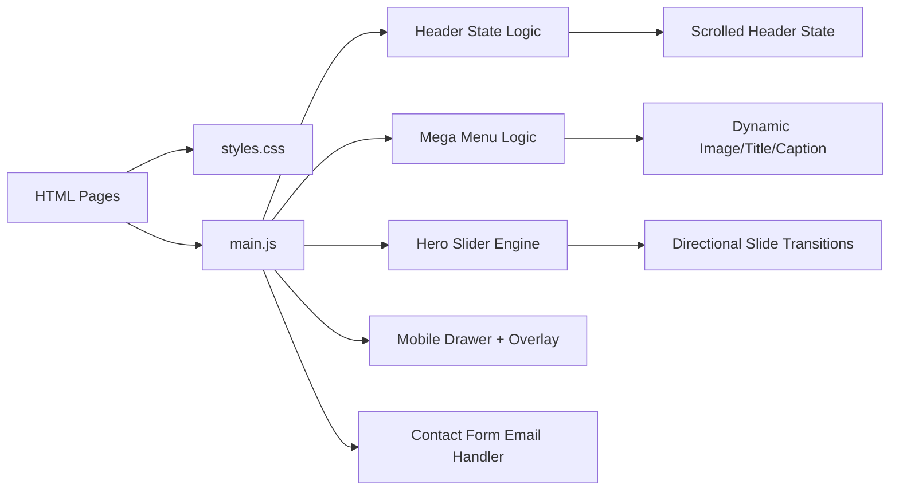

# TotalS - TotalTech Static Website

Professional multi-page static website built with HTML, Tailwind utility classes, custom CSS, and vanilla JavaScript.

## 1. Project Snapshot

- Brand: `TotalTech`
- Stack: `HTML + TailwindCSS + Custom CSS + JavaScript`
- Type: `Static, multi-page marketing website`
- Primary audience: businesses looking for software, product, and cloud services

## 2. Pages

- `index.html` - Home
- `about.html` - About Us
- `services.html` - Services
- `contact.html` - Contact
- `industries.html` - Industries
- `portfolio.html` - Portfolio
- `blog.html` - Blog
- `careers.html` - Careers

## 3. Implemented Work (So Far)

### Navigation + Header

- Zebra-inspired navigation layout adapted for TotalTech content
- Transparent header behavior on top of home hero
- Sticky scrolled-state header behavior on home
- Mobile hamburger menu with backdrop blur overlay
- Mobile quick CTA (`Request a Quote`) near toggle button
- Top utility links in mobile drawer:
  - Industries | Portfolio | Blog | Careers

### Mega Services Dropdown

- Redesigned full-width mega panel
- Three-part layout:
  - Left side: service options in compact cards
  - Right side: live preview image + title + caption
- Category hover/focus updates preview dynamically
- Small category icons included
- Desktop interaction:
  - hover open
  - click toggle
  - outside click + `Esc` close

### Home Hero

- Multi-slide hero with directional transitions
- Custom sequence support and timing
- Smooth transition tuning
- Dot indicators + autoplay handling

### Home Section Redesigns

- `Services Overview` redesigned with premium cards + stat block
- `Development Process` redesigned as structured process cards + summary panel
- `Industries Served` redesigned with modern industry focus cards
- CTA section redesigned with premium two-column shell and action cluster

### Global Design + Components

- Button system upgraded to logo-based gradient theme (`yellow + black mix`)
- Consistent CTA styling across pages
- Footer fully redesigned on all pages with:
  - Logo block
  - CTA strip
  - Capabilities links
  - Contact block
  - Bottom legal/support row

### Mobile/Responsive Improvements

- Mobile menu panel glassmorphism effect
- Toggle overlay blur when drawer opens
- Horizontal overflow control improvements
- Navbar link wrapping issue fix (`About Us` line break fix)

## 4. Color + Typography System

- Primary brand navy: `#0B1C3D`
- Secondary blue: `#1F6BFF`
- Accent teal: `#00E5A8`
- Logo yellow: `#F1D90A`
- Button gradient system:
  - start: `#D4BC00`
  - end: `#000000`
  - hover start: `#F1D90A`
  - hover end: `#080808`

Fonts:

- Headings: `Poppins`
- Body text: `Inter`

## 5. Home Page Flow Chart



## 6. Interaction Diagram



## 7. Folder Structure

```text
TotalS/
  assets/
    css/
      styles.css
    js/
      main.js
    images/
      logo.png
  index.html
  about.html
  services.html
  contact.html
  industries.html
  portfolio.html
  blog.html
  careers.html
  README.md
```

## 8. Run Locally

Any static server can be used.

Example (VS Code Live Server):

1. Open project folder in VS Code
2. Open `index.html`
3. Start Live Server

Or with Python:

```bash
python -m http.server 5500
```

Then open:

`http://127.0.0.1:5500/index.html`

## 9. Current Status

- UI redesign and interaction layer are implemented.
- Project is ready for static hosting.
- Next optional enhancements:
  - backend form endpoint
  - CMS/admin for content updates
  - analytics + SEO schema enhancements
